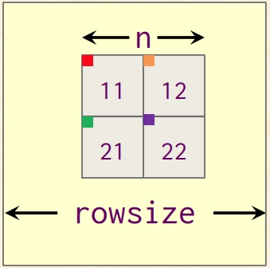

# Profiling Cache-Oblivious Matrix



> "Measure Measure Measure"

Implemented a cache-oblivious matrix multiply algorithm and used the Google Benchmark framework to measure it.

# Resources to help

Below are a list of curated resources that helped me along the way. Consult them (read them, or do <kbd>ctrl+f</kbd> for keywords) if you would like to understand more.

1. Cache-Oblivious Matrix Multiply Example
	- https://www.youtube.com/watch?v=vxkZkcbwU40
2. AVX Tutorial
	- https://www.codeproject.com/Articles/874396/Crunching-Numbers-with-AVX-and-AVX

## The goal

The goal of this was to learn yet another benchmarking tool to create reproducable tests, as well as to implement at least one cache-oblivious algorithm. (Later implementing a second to compare results: Transpose)

## The report

The report lists my findings as well as insight as to possible reasons why and setup.

# Part 1 - Cache-Oblivious

Cache-Oblivious algorithms are algorithms that will eventually fit into each layer of the memory hierarchy (in each layer of the cache), to take advantage of faster memory. [main.cpp](./main.cpp) is a cache-oblivious matrix multiplication and a regular matrix multiplication.

```cpp
// Assume that n is an exact power of 2.
void Rec_Mult(double* C, double* A, double* B, int n, int rowsize) {
    // The smallest 'tile' or our base case where we actually
    // perform a multiplication
    if (n == 1)
        C[0] += A[0] * B[0];
    else {
        // Here we are breaking things into smaller 'tiles'
        // We recursively divide our matrix into smaller pieces
        int64_t d11 = 0;
        int64_t d12 = n/2;
        int64_t d21 = (n/2) * rowsize;
        int64_t d22 = (n/2) * (rowsize+1);
        Rec_Mult(C+d11, A+d11, B+d11, n/2, rowsize);
        Rec_Mult(C+d11, A+d12, B+d21, n/2, rowsize);
        Rec_Mult(C+d12, A+d11, B+d12, n/2, rowsize);
        Rec_Mult(C+d12, A+d12, B+d22, n/2, rowsize);
        Rec_Mult(C+d21, A+d21, B+d11, n/2, rowsize);
        Rec_Mult(C+d21, A+d22, B+d21, n/2, rowsize);
        Rec_Mult(C+d22, A+d21, B+d12, n/2, rowsize);
        Rec_Mult(C+d22, A+d22, B+d22, n/2, rowsize);
    }
}

```

## The task

Ffom here, I modified the naive approach and did the following:

1. Implement a second cache-oblivious implementation of matrix multiply. This time 'n' (lowercase n) was > 1 to take advantage of the SIMD instructions to perform multiple multiplications at once.
2. Used google benchmark to compare (a) regular matrix multiply (b) cache-oblivious matrix multiply(n==1) (c) cache-oblivious matrix mutiply(n>1).
	- Filled out the corresponding report with my results.

### SIMD Speed up

If we look carefully at the example below, `n` is the value that we wanted to tune. This is essentially the size of the tile that we can multiply. Think about if a value of n==2, n==4, n==8, etc. will do better when combined with SIMD instructions to perform multiple multiplication or multiple add instructions. 

```cpp
  if (n == 1)
        C[0] += A[0] * B[0];	
```
