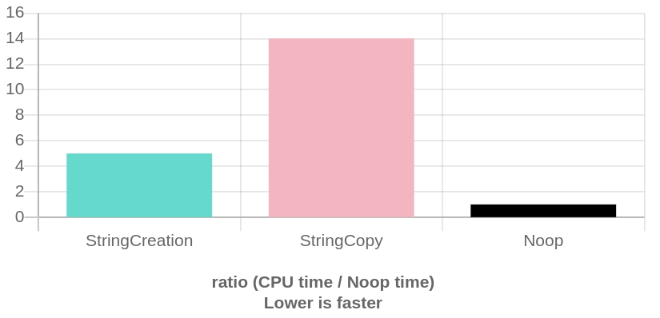

# Part 0 - The Setup

For this assignment we are going to setup some tools to help us profile code.

## Quick-Bench.com

[Quick-Bench](http://quick-bench.com/6PnE7d52HGqvTZKOuBtLpOuNo90) is a handy web tool for quickly testing out various implementations of code.

The web tool builds on top of the [google/benchmark](https://github.com/google/benchmark) tool which allows you to write more powerful tests (i.e. in the web tool, it is unlikely you can do things like access the file system for security purposes). The Google Benchmark tool can also be used to setup benchmarking experiments which can be used as unit tests to compare performance. Since we are attempting to measure as much as possible in this class, this makes it a useful tool!

For this assignment, I want you to setup and use Google benchmark to create a 'unit test' like experiment with performance tests for part 2. For this part, make sure you can run the web tool, and then install the github project on your system.

## The task

1. Check out quick-bench.com and run the default example.
	- Make sure to 'clear cache' on each result to ensure you do not warm up the cache from previous executions.
2. Check out [google/benchmark](https://github.com/google/benchmark) and ensure you can follow the installation instructions.

